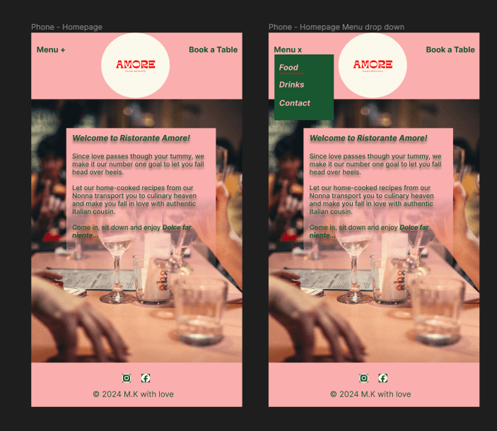
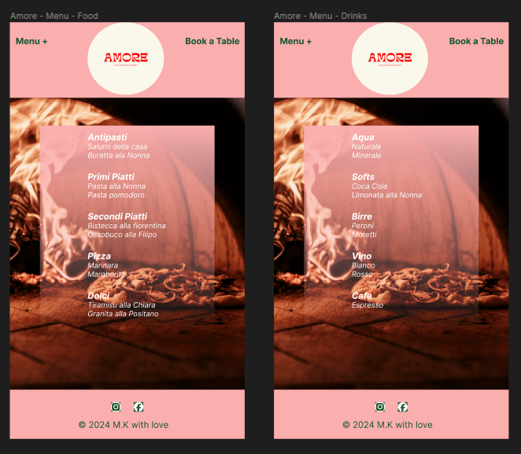
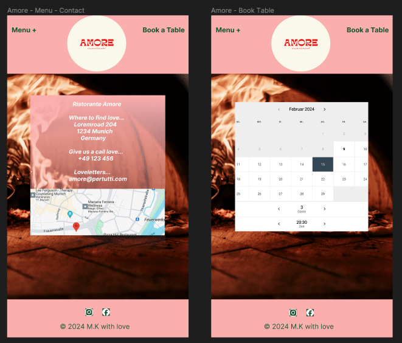

# Ristorante AMORE

## Code Institute Portfolio Project 4


View the deployed site: [Ristorante AMORE](https://restoamore-97664a64d2b2.herokuapp.com/)

Ristorante AMORE is the imagined restaurant’s website showcasing all the pieces of information a guest would need before visiting. The website will enable the user, the imagined guest, to browse through the menu, look up the contact information, and book a table online. 

It will also feature an administrative area allowing the restaurant owner to see the list of bookings and manage the content on his homepage. 

Python, Javascript, HTML and CSS will be the languages used to create this website.

## **Table Of Contents**
* [User Experience](#user-experience)
  * [Strategy Plane](#strategy-plane)
    * [Project Goals](#project-goals)
    * [User Stories](#user-stories)
  * [Scope Plane](#scope-plane)
  * [Structure Plane](#structure-plane)
    * [Database Shema](#database-shema)
  * [Skeleton Plane](#skeleton-plane)
    * [Wireframes](#wireframes)
  * [Surface Plane](#surface-plane)
    * [Color Sheme](#color-sheme)
    * [Typography](#typography)
  * [Features](#features)
    * [Navigation](#navigation)
    * [Homepage](#homepage)
    * [Food Menu](#food-menu)
    * [Drinks Menu](#drinks-menu)
    * [Contact](#contact)
    * [Login Form](#login-form)
    * [Sign Up Form](#sign-up-form)
    * [Booking Form](#booking-form)
    * [Bookings Overview](#bookings-overview)
    * [Logout](#logout)
    * [Footer](#footer)
    * [Admin Features](#admin-features)
  * [Future Features](#future-features)
  * [Technologies](#technologies)
    * [Languages](#languages)
    * [Third Party Technologies](#third-party-technologies)
  * [Testing](#testing)
  * [Deployment](#deployment)
    * [Deploying To Heroku](#deploying-to-heroku)
  * [Forking The Repository](#forking-the-repository)
  * [Cloning The Repository](#cloning-the-repository)
  * [Credits](#credits)
    * [Media](#media)
    * [Content](#content)
      
---

## User Experience

### Strategy Plane

#### **Project Goals**

Ristorante AMORE is a restaurant website. 

The site’s primary users will be guests who want to visit the restaurant. Ristorante AMORE aims to give future guests a look into the current menu, directions to the restaurant, contact possibilities, and a simple reservation tool that allows the user to book a table, view their booking, and in case edit or delete their reservation. 

For the restaurant owner, there will be an administrative area that allows the manager/ site administrator to update the menu and homepage content as well as viewing the reservations made by users/ guests. 

#### **User Stories**

The User Stories were created and categorized using the prioritization technique of the MoSCoW method. 

| | As a / an | I want to be able to… | So that I can…  |
|----|----|----|----|
| Navigation and Viewing        |   |   |   |
| 1  | Site Visitor | Easily navigate the site                  | Find the information I require                                      |
| 2  | Site Visitor | View the restaurant's menus               | Get an overview of the food and drink items that are available      |
| 3  | Site Visitor | View the location and contact details     | Find and contact the restaurant                                     |
| 4  | Site Visitor | View the opening hours                    | See when the restaurant is open                                     |                                                   
| Reservations and Registration |   |   |   |
| 5  | Site Visitor | Easily register for an account            | Book a table online                                                 |
| 6  | Site Visitor | Easily log in                             | Book a table online and manage my bookings                          |
| 7  | Site Visitor | Easily log out                            | So that no one can change my booking and keep it safe               |
| C R U D Functionality         |   |   |   |
| 8  | Site Visitor | Create a online table reservation         | Secure a table for a specific date, time and group size             |
| 9  | Site Visitor | Read/ View my booking(s)                  | See that the reservation was successful and use as reminder         |
| 10 | Site Visitor | Update my booking(s)                      | Make necesary changes  to my reservation                            |
| 11 | Site Visitor | Delete/ cancel my booking(s)              | Have the reservation removed from the restaurant's system           |
| Site Administration           |   |   |   |
| 12 | Site Owner | Add items to the menu                       | Add new and seasonal food and drinks                                |
| 13 | Site Owner | Edit a menu item                            | Update/ change the price or category of a menu item                 |
| 14 | Site Owner | Delete a menu item                          | Remove food and drink items that aren't available                   |
| 15 | Site Owner | Manage the opening dates and hours          | Prevent bookings to be made on days the restaurant is closed        |
| 16 | Site Owner | View the bookings that are made             | Prepare the required table(s)                                       |

### Scope Plane 

The following user requirements and expectations were used to plan the Scope of the project.

* A Navigationbar that is simple and intuitive
* Responsive design that is visually appealing on all screen sizes
* A short introduction to the site and its purpose
  
* Basic information about the restaurant:
  * Contact details and directions
  * Menu
    
* Authentication:
  * Registration/ Sign in feature
  * Log in/out feature
    
* CRUD functionality for logged in users:
  * Creata/ make bookings
  * Read/ view bookings
  * Update/ adjust bookings
  * Delete/ cancel bookings
    
* CRUD functionality for site admin:
  * View bookings
  * Update menus and page contect

### Structure Plane

#### **Database Shema**

### Skeleton Plane

#### **Wireframes**

I created my wireframes using Figma. During production I added further features that aren't displayed in the wireframes. 
These were created to give guidance when coming to the design. 

Homepage wireframes:



Food and drinks menu wireframes:



Contact and calendar wireframes:



### Surface Plane

#### **Color Sheme**

I wanted my color palatte to reflect the mood of an romantic restaurant in Italy. 
With the name of the restaurant being AMORE it was clear to me that red and pink elements should be used. 
For the darker shades I chose a dark green, that should be reminiscent of basil and the green in the italian flag, and a dark blue that shall depict an not too dark evening sky. 


#### **Typography**

## Features

### **Homepage**

### **Food Menu**

### **Drinks Menu**

### **Contact**

### **Login Form**

### **Sign Up Form**

### **Booking Form**

### **Bookings Overview**

### **Logout**

### **Footer**

## **Admin Features**

## **Future Features**

## **Technologies**

### **Languages**
* HTML 
* CSS
* JavaScript
* Python

### **Third Party Technologies**
* Django - used as Python framework for the project
* Gunicorn - Python HTTP server for WSGI applications
* Python Moduls
  * asgiref==3.7.2
  * cloudinary==1.39.0
  * dj-database-url==0.5.0
  * dj3-cloudinary-storage==0.0.6
  * Django==3.2.24
  * gunicorn==21.2.0
  * psycopg2==2.9.9
  * pytz==2024.1
  * sqlparse==0.4.4
  * urllib3==1.26.15
* Heroku - used as cloud-based platform for deploying the project
* ElephantSQL - databse hosting service
* Cloudinary - cloud platform for storing static files
* Git - used for version control
* GitPod - IDE used for creating the project
* GitHub - used for storing project files
* Bootstrap - used for styling and responsivness
* Google Fonts - import of fonts to use in project
* Font Awesome - import of icons to use in project
* Figma - used to create the wireframes of the project
* Favicon - used for creating the favicon for the project
* Am I Responsive - used for multi device mockup
* DBDiagram - used for creating the database sheme
* Coolers - used to create color sheme

  
## **Testing**

## **Deployment**

### **Deploying To Heroku**
The project was deployed to Heroku and was set to automatically update when pushed to GitHub. 

The project is currently hosted on Heroku. 

1. Create new external database on [ElephantSQL](#https://www.elephantsql.com/)
   * Login in to your ElephantSQL account (if you don't have an account create one)
   * Click "Create New instance" 
   * Enter a "Name to describe yout instance" for your database and select the "Tiny Turtle (free)" plan
   * Proceed to click "Select Region" 
   * Select a region and continue by clicking on "Review"
   * Check the information and then click on "Create instance"
   * Return to dashboard and select your created new instance
   * Copy the URL that can be found in the URL section so it can be added to your Heroku App in a few steps

<!-- The following content was taken from the Django Blog Cheat Sheet of CodeInstitute -->
2. Attach the Database
   * In the IDE file explorer or terminal create a new **env.py** file on top level directory
    * In the **env.py** file enter: 
      ``` python
      import os
      ```
      
    * Set environment variables:
      ``` python
      os.environ["DATABASE_URL"] = "Paste in ElephantSQL URL"
      ```
      
    * Add secret key:
      ``` python
      os.environ["SECRET_KEY"] = "Enter your own uniqueSecretKey"
      ```
      
3. Preparation of environment and **settings.py** file
   * In **settings.py** under "from pathlib import Path" add:
     ``` python
     import os
     import dj_database_url
     
     if os.path.isfile('env.py'):
       import env
     ```

   * In **settings.py** replace SECRET_KEY instance:
     ``` python
     SECRET_KEY = os.environ.get('SECRET_KEY')
     ```
     
     * Replace current DATABASES Section: <br>
     ``` python
     DATABASES = {
       'default':
     dj_database_url.parse(os.environ.get('DATABASE_URL'))
     }
     ```
     
   * Save files and make migrations:
     * In terminal run:
     <br> ``` python3 manage.py migrate```
       
4. Getting static and media files stored on [Cloudinary](https://cloudinary.com/users/login):
   * Login in to your Cloudinary account (if you don't have an account create one)
   * Copy your API enviroment variable from the Cloudinary Dashboard
   * Add Cloudniary URL to **env.py** file:
     ```python
     os.environ['CLOUDINARY_URL'] = 'cloudinary://*************'
     ```
   * In **settings.py** add Cloudinary Libraries to installed Apps:
     ``` python
     INSTALLED_APPS = [
     ...,
     'cloudinary_storage',
     'django.contrib.staticfiles',
     'cloudinary',
     ...,
     ]
     ```
     * Tell Django to use Cloudinary to store media and static files: <br>
     ``` python
     STATIC_URL = '/static/'

     STATICFILES_STORAGE = 'cloudinary_storage.storage.StaticHashedCloudinaryStorage'
     STATICFILES_DIRS = [os.path.join(BASE_DIR, 'static'),]
     STATIC_ROOT = os.path.join(BASE_DIR, 'staticfiles')

     MEDIA_URL = '/media/'
     DEFAULT_FILE_STORAGE = 'cloudinary_storage.storage.MediaCloudinaryStorage'
     ```
     * Link file to the templates directory: <br>
     ```python
     TEMPLATES_DIR = os.path.join(BASE_DIR, 'templates')
     ```
     * Change templates directory: <br>
     ``` python
     TEMPLATES = [
     {
        …,
        'DIRS': [TEMPLATES_DIR],
        …,
          ],
        },
       },
     ]
     ```
     * Add Heroku Hostname to ALLOWED_HOSTS:
       ``` python
       ALLOWED_HOSTS = ["PROJ_NAME.herokuapp.com", "YOUR_HOSTNAME"]
       ```
6. Create a **Procfile** on the top level directory: 
   * Add following code to Procfile: <br>
     ``` python
     web: gunicorn PROJ_NAME.wsgi
     ```
7. Save all files, commit and push code to repository:
   <br> ``` git add . ```
   <br> ``` git commit -m 'Deployment Commit' ```
   <br> ``` git push ```
                
6. Create the App on [Heroku](https://id.heroku.com/login):
   * Login in to your Heroku account (if you don't have an account create one)
   * Click "New" in the top right and select "Create new app"
   * Enter an App name (must be unique) and select the region closest to you, continue by clicking on "Create app"
   * Go to the "Settings" tab and scroll down to "Reveal Config Vars"
   * Add the following KEY's and VALUE's to Config Vars: <br>
     | KEY                   | VALUE                                                                  |  
     | ----------------------|:----------------------------------------------------------------------:|
     | DATABASE_URL          | DATABASE_URL copied from ElephantSQL                                   |
     | SECRET_KEY            | uniqueSecretKey created in env.py                                      |
     | CLOUDINARY_URL        | CLOUDINARY_URL (cloudinary://*******) copied from Cloudinary Dashboard |
     | DISABLE_COLLECTSTATIC | 1                                                                      |
     | PORT                  | 8000                                                                   |

   * Go to the "Deploy" tab and choose "GitHub" as "Deployment method"
   * Select the repository that shall be deployed and click "Connect"
   * Scroll to the end of the page and click "Deploy Branch" to manually deploy through Heroku
     
## **Forking The Repository**

## **Cloning The Repository**

## **Credits**

### **Media**

### **Content**


    


