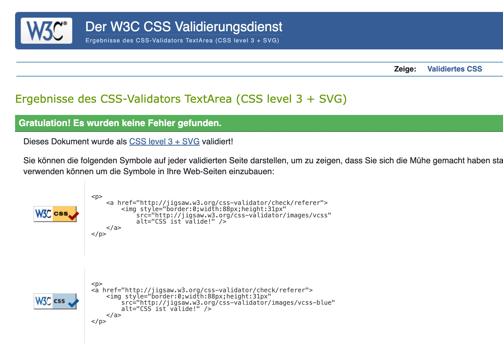
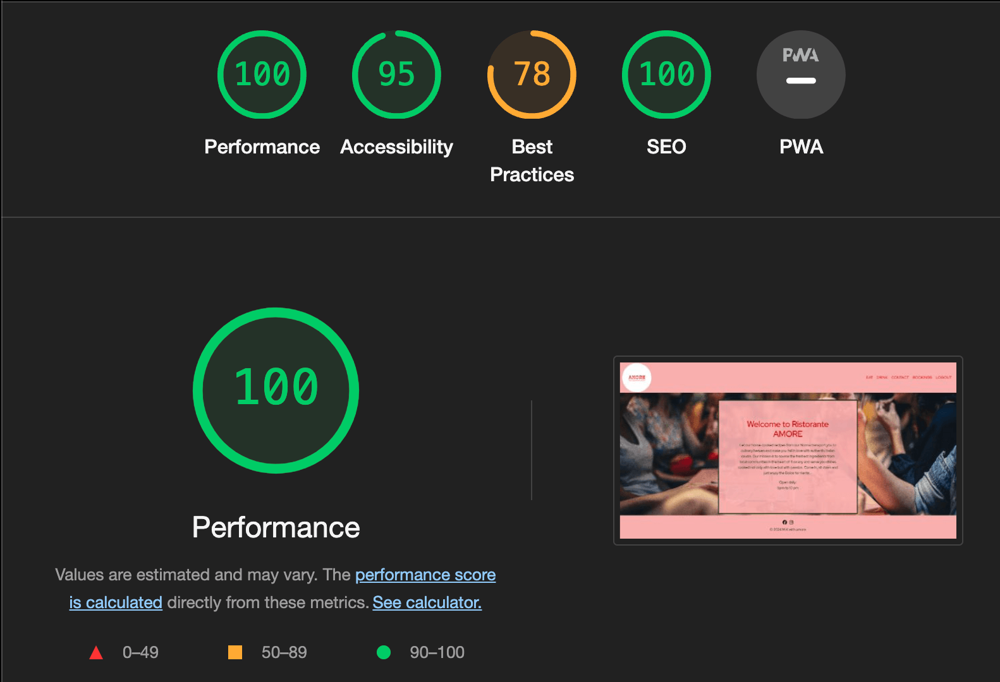
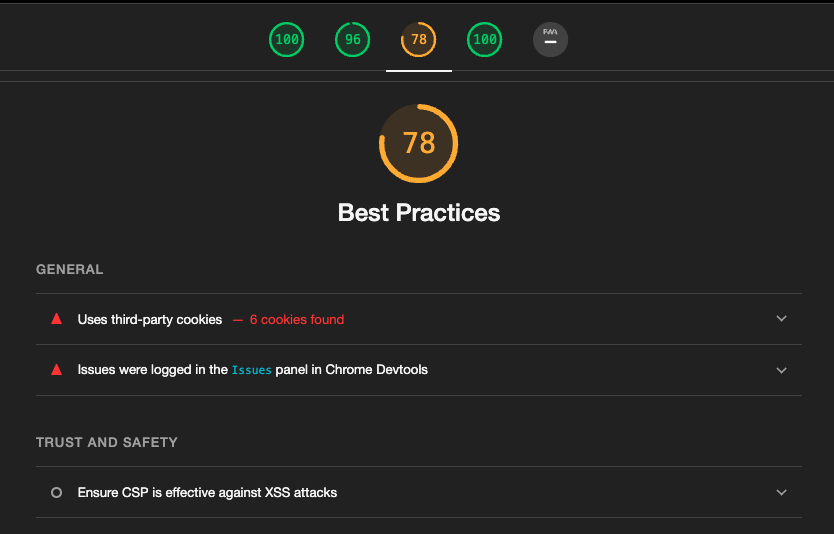

# Ristorante AMORE

This document containts all testing information for **Ristorante AMORE**.

View the deployed site: [Ristorante AMORE](https://restoamore-97664a64d2b2.herokuapp.com/)

# User Story Testing

To ensure the user stories were implemented properly and operate accordingly they were tested manually. 

| | As a / an | I want to be able to… | Expectation  | Result |
|----|----|----|----|----|
| Navigation and Viewing        |   |   |   |
| 1  | Site Visitor | Easily navigate the site                  | Homepage that displays a navbar that easily navigates through the different sections of the site        | Pass |
| 2  | Site Visitor | View the restaurant's menus               | A food and drinks menu that gives information about the available items and their prices.               | Pass |
| 3  | Site Visitor | View the location and contact details     | A contact page with that lists all contact details and gives exact information of the location          | Pass |
| 4  | Site Visitor | View the opening hours                    | A section where the opening hours can be found                                                          | Pass |
| Reservations and Registration |   |   |   |
| 5  | Site Visitor | Easily register for an account            | A registration form with clear instructions how to register                                             | Pass |
| 6  | Site Visitor | Easily log in                             | A login form with clear instructions how to login                                                       | Pass |
| 7  | Site Visitor | Easily log out                            | A logout button that loggs the user out and confirmation message that logout was successfull            | Pass |
| C R U D Functionality         |   |   |   |
| 8  | Site Visitor | Create a online table reservation         | A booking form where guest can reserve a table for a predefined day,time and number of people           | Pass |
| 9  | Site Visitor | Read/ View my booking(s)                  | A list of all bookings that where made by the user                                                      | Pass |
| 10 | Site Visitor | Update my booking(s)                      | A form where the user can adjust the booking and a message that the update was successfull              | Pass |
| 11 | Site Visitor | Delete/ cancel my booking(s)              | A delete button and confirmation option about deletion following a successfully deleted message         | Pass |
| Site Administration           |   |   |   |
| 12 | Site Owner | Add items to the menu                       | An option to add food and drinks items with their names, prices and category in restricted admin area    | Pass |
| 13 | Site Owner | Edit a menu item                            | An option to edit the name, ptice and category of menu items in restricted admin area                    | Pass |
| 14 | Site Owner | Delete a menu item                          | An option to delete a menu item with their name,price and category in restricted admin area              | Pass |
| 15 | Site Owner | Manage the opening dates and hours          | An option to redefine opening hours and dates in admin area (user story not implemented)                 | Fail |
| 16 | Site Owner | View the bookings that are made             | A list of all bookings made by the guest/ user     in restricted admin area                              | Pass |

As of now the user story nr. 15 wasn't implemented since it only was a could have. This can be implemented as a future feature. 

# Validation Testing

## [HTML Validation](https://validator.w3.org/nu/)

Using the deployed Heroku app, each url was run though the W3C HTML Validator successfully. 

The following was corredcted:
In the iframe on the contact page I used percentages for width and height. I changed this and specified the height and width with numerical values to represent the pixel dimensions.

## [CSS Validation](https://jigsaw.w3.org/css-validator/)

The CSS from the static file was directly input to the CSS Validator and no errors were found.

## [Python Validator](https://pep8ci.herokuapp.com/)

Pep8 CI was used to validate python code and the following errors were corrected:

- blank lines contain whitespace
- lines too long 
- need new lines at end of file

## [Lighthouse](https://developer.chrome.com/docs/lighthouse/overview/)
Lighthouse was used check on performance and accessibility. 
Overall the scores of the Performance,Accessibility and SEO were 100 and never lower than 95. 
The only low score was Best Practices with a score of 78. This is due to the "Uses third-party cookies" warning. 
Since it refers to the use of cookies set by third-party domains on my website and time ran out I didn't address this issue.

An example of the testing and the error: 

# Bugs

## Bugs Outstanding
 At the moment when booking a table in the booking form it is possible to book a table in the past. 
 Since the contact details of guest are being requested when making a booking as for now the admin/ restaurant manager can contact the guest and inform them about the mistake. 
 Running out of time I didn't prioritize this issue but will fix it in the future. 

